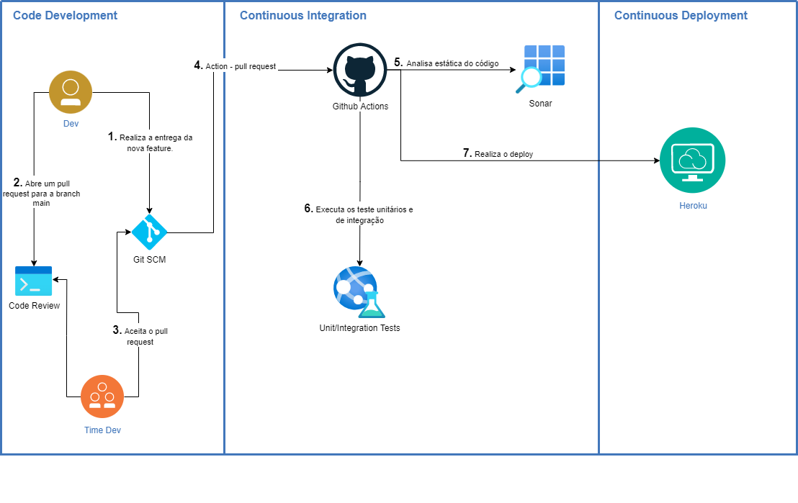

# Projeto de avaliação da Disciplina - DevOps

## Componentes de avaliação 

## 1. Modelo de Workflow escolhido pelo grupo foi Git Feature Branch Workflow, justificativas da escolha:
  
  **a. Vantagens?** 
  O Git Feature Branch Workflow, é uma fluxo simples e baseado em branchs de funcionalidades, partindo de branch principal(main), como fluxo de revisão de código. 
  Permiti que tenhamos um fluxo de integração de código continuo e de entregas continuas, sendo bem indicado para o nosso projeto, pois utilizamos as práticas DevOps. Defini um fluxo de pull request, que além de validar o código que será integrado a branch principal, compartilha com o time o que foi feito e a forma que está implementado, dividindo o conhecimento e a responsabilidade. Não exige uma carga cognitiva muito alto do time, para manter o fluxo de trabalho coeso e integrado. 
  O Fluxo também pode ser usado como base, para customizações ou utilizações com outros Workflows. 

  **b. Desvantagens?** 
    - O uso do rebase para atualização da branch feature pode ser complexo em determinadas situações. 
    - Caso o código tenha sido integrado com a branch principal antes da hora, pode ser necessário realizar reversão de código, para manter a Branch principal fiel ao que esta em produção. 

  **c. Quais os cenários o grupo entende que o pipeline será capaz de cobrir, aqui considere elementos como features releases, tags, visualização de histórico dos commits etc.**
  Entendemos que o Git Feature Branch Workflow, cobre todo o pipeline definido para o projeto. Através do fluxo de trabalho escolhido, teremos branch’s para cada funcionalidade, que permiti paralelizar o desenvolvimento e integrar o código de forma contínua, disparando o pipeline de validação, construção e entrega do projeto. 
  A cada nova versão será criada uma tag, para possibilitar consultar o código de uma versão especifica ou até mesmo voltar para uma versão a partir de uma tag. 

  **d. Qual o modelo de integração que será utilizado com o pipeline (Delivery ou Deployment Contínuo) e quais as motivações para esta escolha;**
  Optamos pelo pipeline de Deployment Contínuo(CI/CD), para gerar constantemente valor para o cliente, como disponibilização de novas funcionalidades e correções de bugs. 
  Através de entregas menores e contínuas conseguimos diminuir a quantidade erros em produção, aumentando a quantidade de entregas e diminuindo a complexidade caso seja necessária uma reversão de versão. 
  Nas etapas do pipeline, existem verificações de qualidade do código e testes automatizados, para tentar garantir que as funcionalidades já existentes continuem funcionando e que as novas tenham testes suficientes para entrar em produção. 

## 2. Representação grafica 

  1. O Dev cria a branch da nova funcionalidade a partir da branch principal(main), e realiza o desenvolvimento da nova funcionalidade, atualiza o repositório central com periodicidade para evitar perda que código. 
  2. Após a conclusão do desenvolvimento, abre um pull request, para que um ou mais desenvolvedores do time realizem o code review.
  3. Após a análise do código, o desenvolvedor responsável pelo code review pode aprovar ou solicitar correções nos commits enviados. 
  4. Quando o pull request é aprovado, o pipeline é iniciado, conforme configurado no workflow.
  5. É realizado uma análise estática do código através da ferramenta sonar.
  6. É executado todos os testes unitários e de integração, nesse momento também é avaliada a cobertura de código novo e antigo, caso não alcance 80% de cobertura o pipeline é interrompido.
  7. Dispara o deploy no serviço de cloud da Heroku.

## 3. Código do pipeline.
Criamos um projeto simples, para aplicação do pipeline definido pelo grupo. 
Utilizamos o github actions para criação do pipeline, no arquivo `.github/workflows/ci-cd.yml` esta 
definido o workflow.

  - Testando a API:
  `curl -X POST 'https://consents-api.herokuapp.com/generate' `